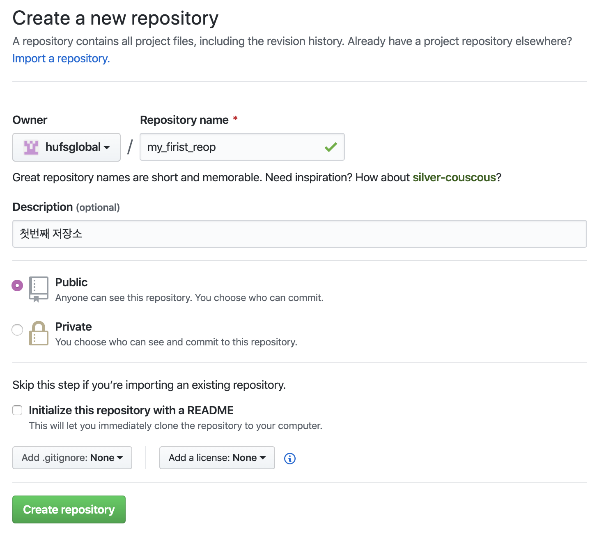
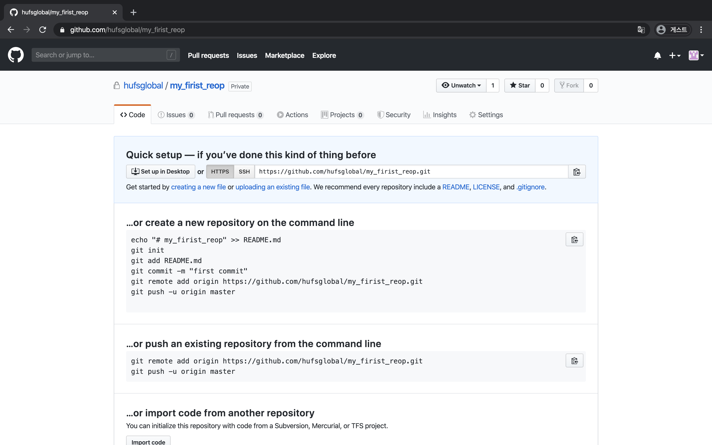
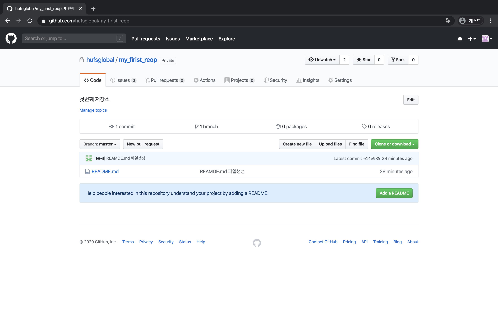

github
=

### 깃헙 사용
깃의 기본 명령어를 사용해보았으니 이제 본인의 코드를 github에 업로드 해보겠습니다.  
처음 켜두었던 깃헙 화면의 왼쪽의 초록색 create repository 버튼을 선택하거나 오른쪽 상단부의 + 버튼을 선택후 나오는 new repository 를 선택해주세요


### 저장소 설정
저장소의 이름과 간단한 설명 그리고 공개 범위를 public으로 설정 후 하단부의 create repository를 선택해주세요.  



### 코드 업로드
저장소 생성이 완료되었다면 우리 컴퓨터에 있는 파일을 깃헙에 연결하여 업로드 해보겠습니다.  
화면 가운데에 우리가 진행했던 git 저장소 init, add, commit 이 보이고 다른 명령어도 보입니다.  
영어제목들을 간단히 해석해보면 컨맨드라인에서 새로운 래포를 생성, 이미 존재하는 래포를 push, 다른 래포의 코드를 import 하기  입니다.  
저희는 이중에서 두번째인 존재하는 래포를 push 하기 를 진행하겠습니다. 다시 vscode로 돌아오세요


``` bash
## 두가지 명령어를 한개씩 입력해주세요
$ git remote add origin https://github.com/hufsglobal/my_firist_reop.git
$ git push -u origin master
Enumerating objects: 3, done.
Counting objects: 100% (3/3), done.
Writing objects: 100% (3/3), 231 bytes | 231.00 KiB/s, done.
Total 3 (delta 0), reused 0 (delta 0)
To https://github.com/hufsglobal/my_firist_reop.git
 * [new branch]      master -> master
Branch 'master' set up to track remote branch 'master' from 'origin'.
## 무엇인가가 진행됨을 확인할수 있습니다. 다시 github으로 가보겠습니다. 
```

성공적으로 우리가 만들었던 README.md 파일이 github에 업로드하였습니다.  

