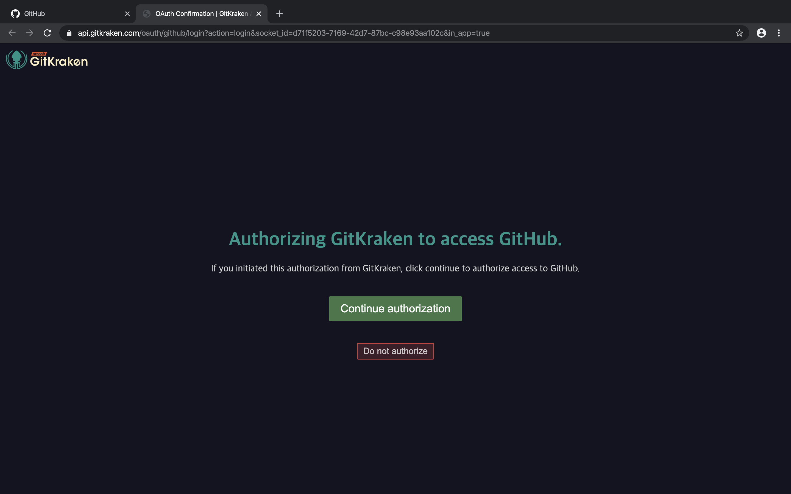

kraken
=

터미널을 통해서 깃 명령어들을 직접 입력하여서 깃을 사용할 수 있지만 이 방법이외에도 소프트웨어를 통해서 GUI를 통해서 사용할수도 있다.  
gitkraken이라는 서비스를 다운로드 받아서 실행해본다. [gitkraken 다운로드](https://www.gitkraken.com/b?utm_expid=.W2nHbF0ARIqaOuS7QxW-pA.1&utm_referrer=https%3A%2F%2Fwww.google.com%2F)  


sign in with github 을 선택하여서 깃헙 연동을 시작합니다.  


이후 깃헙과의 연동 확인 페이지로 넘어가게됩니다. 여기서 continue를 선택해주세요.  


깃헙에 로그인이 되어있다면 해당 화면과 함께 깃헙에서 권한 부여하는 해당 화면으로 나옵니다.  
로그아웃상태라면 로그인과 함께 단계가 진행되거나 진행을 멈춘후 로그인을 진행하고 이후에 과정을 다시 시작하세요.  


권한이 부여되었다면 success 화면이 나오고 kraken으로 돌아오면 이름과 메일을 적어주는 창이 나옵니다.  
그곳에 본인의 깃헙 닉네임과 이메일을 적고 마무리 합니다.  


new tab의 왼쪽 의 open a repo를 선택해주세요.  


repository management 창이 나온다면 open a repository 를 선택합니다.  


나오는 창에서 본인이 vscode 에서 작업하였던 첫번째 레포 폴더를 찾아서 더블클릭합니다.  


본인의 첫 레포에 대한 git 관련 사항들이 화면에 나옵니다. 


README.md 파일 마지막에 아래와 같은 내용을 추가 하고 파일을 저장하였습니다. (ctrl + s)
``` markdown
gitkraken을 설치했습니다.  
```
그리고 다시 돌아오면 화면이 사진과 같이 변경되어있습니다. 수정사항이 생겼다는 표시인데요.  
unstaged file 의 readme.md 파일을 선택해보세요. 


파일의 변경사항에 대해서 나옵니다. 이제 파일명 옆에 있는 stage file을 선택합니다. 


그러면 파일이 하단부 staged file 로 이동합니다.  


아랫부분 commit message 에 메시지를 작성하고 하단부 commit 초록색 버튼을 선택.  


새로운 커밋이 생성된것을 알수 있습니다. 커밋 메세지의 왼편으로 master 의 이모티콘 표시와 master의 컴퓨터 표시두개로 표시나 나뉜것을 확인할 수 있습니다.  
이는 이모티콘은 github에 업로드 되어있는 버전의 위치 컴퓨터 표시는 로컬에 있는 버전의 위치 입니다.  
해당 상태에서 알수 있듯이 로컬환경에서 한번더 커밋을 하였기 때문에 로컬의 버전이 깃헙과 다른것을 알수 있습니다.  
터미널에서 push 했던것처럼 상단의 push 버튼을 선택하여서 깃헙으로 푸시 해줍니다.  


푸시 이후 깃헙과 로컬의 버전이 맞추어졌습니다. 깃헙페이지를 확인해보세요.  


깃헙에 정상적으로 코드가 업로드 된것을 확인할 수 있습니다.  


이렇게 gitkraken을 확인하면 명령어의 실수 없이 GUI 환경에서 버튼클릭과 커밋 메시지 작성만으로 깃을 사용할수 있습니다.  
git을 테스트 할 수 있는 repo를 만들거나 현재 있는 repo를 활용하여서 git - github - gitkraken 에 적응해보세요.  


