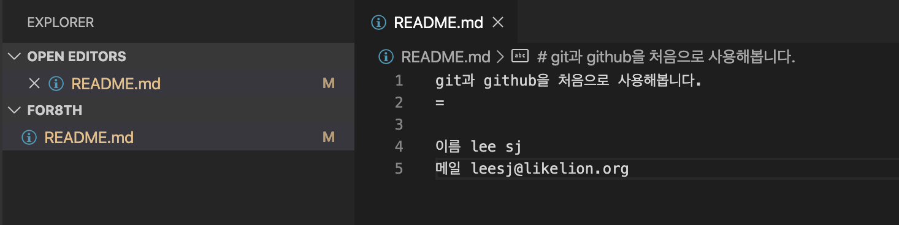
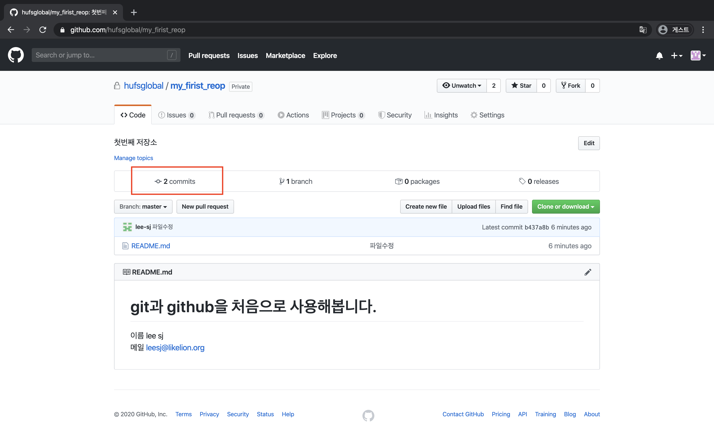
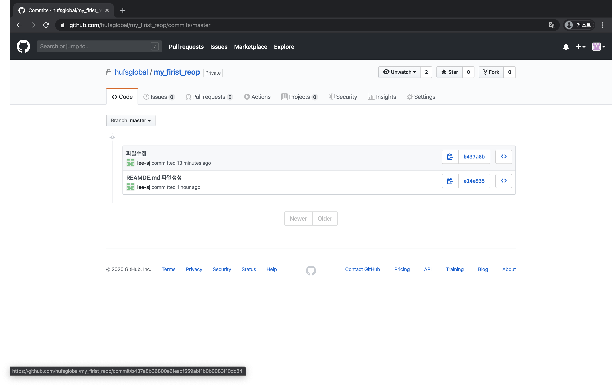
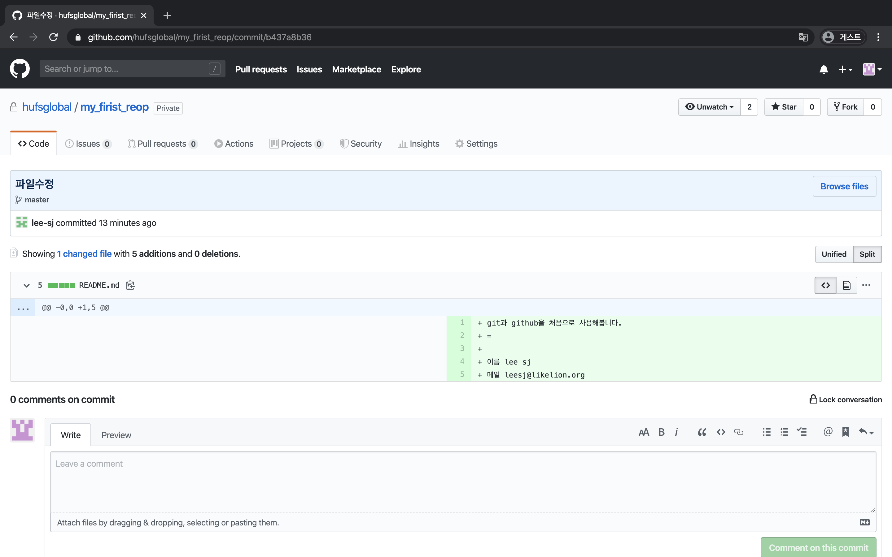

add-commit-push
=

깃의 간편한 사용과 깃헙 연결까지 해보았습니다.  
한번더 반복하여서 해보겠습니다. 

### add
``` markdown
## add는 변경사항을 git에 추가해줍니다. README.md 파일에 아래와 같이 적고 git add를 해줍니다. 
git과 github을 처음으로 사용해봅니다. 
=

이름 lee sj  ## 뒤에 space bar를 두번 입력해주세요 markdown확장자는 space 두번을 줄변경으로 인식합니다.
메일 leesj@likelion.org  
```
아래의 화면처럼 파일에 내용을 입력합니다. (사실 입력하는 내용은 자유입니다.)



사진처럼 내용을 입력후 저장하면 왼쪽 파일트리에서 M 이 표시되고 글씨에 색도 입혀지는것을 알수 있습니다.  
이 상태는 Modified 된 상태 한마디로 수정 상태입니다.  
이제 깃에 수정된것을 알려줍니다 `git add README.md`를 입력합니다.  
그리고 `git commit -m "파일수정"` 커밋 명령어를 통해서 수정사항을 저장해줍니다.  

``` bash
iseongjun-ui-MacBookPro:for8th leesj$ git add README.md 
iseongjun-ui-MacBookPro:for8th leesj$ git status
On branch master
Your branch is up to date with 'origin/master'.

Changes to be committed:
  (use "git reset HEAD <file>..." to unstage)

        modified:   README.md

iseongjun-ui-MacBookPro:for8th leesj$ git commit -m "파일수정"
[master b437a8b] 파일수정
 1 file changed, 5 insertions(+)
iseongjun-ui-MacBookPro:for8th leesj$ git status
On branch master
Your branch is ahead of 'origin/master' by 1 commit.
  (use "git push" to publish your local commits)

nothing to commit, working tree clean
## 커밋까지 완료후 git status 를 확인해보겠습니다. 해당 내용은 아래와 같이 '해석 -> 의역' 할 수 있습니다. 
## 'origin/master' 의 위로 1개의 커밋이 있습니다. -> 깃헙에 저장된 내용 말고 추가 변경사항이 있습니다. 
## git push 를 사용해서 local의 커밋을 발행하세요 -> git push 로 내 컴퓨터의 코드를 깃헙에 올려보세요

## 그럼 다시 push ! 그리고 github 사이트 확인
$ git push
Enumerating objects: 5, done.
Counting objects: 100% (5/5), done.
Delta compression using up to 8 threads
Compressing objects: 100% (2/2), done.
Writing objects: 100% (3/3), 352 bytes | 352.00 KiB/s, done.
Total 3 (delta 0), reused 0 (delta 0)
To https://github.com/hufsglobal/my_firist_reop.git
   e14e935..b437a8b  master -> master
## 처음에 git push origin -u master 를 입력하였다면 그다음부터는 git push 로 단축하여 사용할 수 있습니다. 

```


이렇게 처음 init - add - commit - remote - push 의 과정을 거쳤다면 이후부터는  
add - commit - push 의 3가지의 단계를 통해서 나의 파일을 관리할 수 있습니다.  
  
그리고 github repo의 화면에서 N(숫자) commit 라고 적혀있는 빨간색 부분을 클릭하면 지금까지의 커밋한 내용들을 모두 확인할 수 있습니다.  
그리고 각 각의 커밋(저장 내역)에서 어떠한 변경사항이 생겼는지도 확인할 수 있습니다. 



[이전으로](github.md)  
[README.md 로 이동](../README.md)  