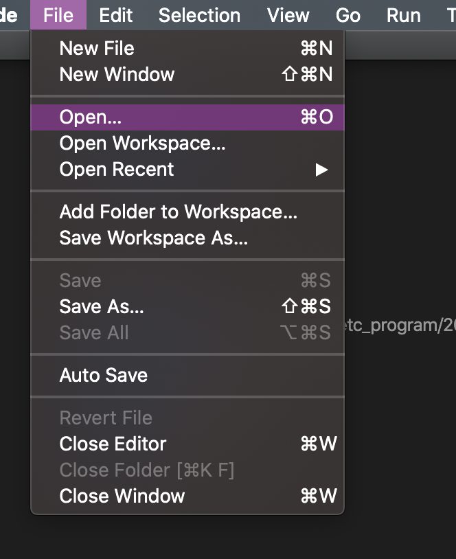

git-config
=

깃의 설치가 되었다면 기본적인 사용전 먼저 기초 설정을 해주어야 합니다.  
``` bash
## 해당명령어의 NAME 에 깃헙 닉네임 설정
$ git config --global user.name "NAME"

## 해당 명령어의 EMAIL 에 깃헙 계정 메일 설정
$ git config --global user.email EMAIL
```
위와 같이 설정하였다면 이제 기본적으로 git 명령어를 사용할때 본인의 깃헙 계정명과 이메일이 자동 저장되어서 활용됩니다.  
이제 간단한 기본 세팅을 진행하였으니 처음으로 git을 사용해보겠습니다.  
vscode 설정의 file > open 을 통해서 본인이 원하는 위치에 폴더를 새로 만들어서 열기를 통해서 해당 폴더로 들어오세요.  



다시한번 사라진 terminal을 켜주시고 `pwd`를 입력하면 현재의 파일위치가 나옵니다. 
``` bash
$ pwd
/Users/leesj/Desktop/for8th

## init을 통해서 git을 초기화(initialize) 합니다. 
$ git init
Initialized empty Git repository in /Users/leesj/Desktop/for8th/.git/

## .md 파일(markdown 확장자)을 한개 만듭니다.
### 파일이 만들어지면 왼쪽에 파일이 만들어지고 이름에 초록색이 보이며 U 표시가 나타납니다. 
$ touch README.md

## git 의 로그를 확인해보겠습니다. 
$ git log
fatal: your current branch 'master' does not have any commits yet ## 간단히 해석하자면 아무것도 없다고 하네요. 

## 현재 git의 상태를 확인합니다. 
$ git status
On branch master

No commits yet

Untracked files:
  (use "git add <file>..." to include in what will be committed)

        README.md

nothing added to commit but untracked files present (use "git add" to track)
## 위와 같은 상태를 간단히 해석한다면 'README.md 파일이 생성되었고 git을 통해 해당 파일을 관리하고자 한다면 git add 명령어를 사용해주세요.' 입니다. 

## 설명을 그대로 따라보도록 하겠습니다. add를 실행하고 바로 상태를 확인해보겠습니다. 
$ git add README.md
$ git status
On branch master

No commits yet

Changes to be committed:
  (use "git rm --cached <file>..." to unstage)

        new file:   README.md
## git에 의해서 new file이 추적되었다는 뜻이지만 이것이 commit 되지 않았다고 합니다. 

## 이를 쉽게 설명하자면 변경사항이 확인되었으나 현재 상태가 저장되지 않았다는 뜻입니다. 바로 다음 과정까지 진행하고 연달아서 상태확인!
$ git commit -m "REAMDE.md 파일생성"
[master (root-commit) e14e935] REAMDE.md 파일생성
 1 file changed, 0 insertions(+), 0 deletions(-)
 create mode 100644 README.md

$ git status
On branch master
nothing to commit, working tree clean
## commit 명령어로 파일 변경을 저장함과 이후 추가로 저장할 변경사항이 없는것을 확인할 수 있습니다.

## 그렇다면 정상적으로 저장되었는지 log를 확인해보죠
$ git log
commit '숫자와 영어가 포함된 난수' (HEAD -> master)
Author: '계졍명과 이메일'
Date:   '날짜'

    REAMDE.md 파일생성
## 정상적으로 저장된것을 확인할 수 있습니다. 
```

여기까지 기본적인 git의 명령어 사용에 대해서 알아보았습니다. 
``` bash
## 깃 초기화
$ git init

## 깃에 파일 추가
$ git add 파일명

## 깃에 변경사항 저장
$ git commit -m "메시지"

## 깃의 상태 확인
$ git status

## 깃의 로그 확인
$ git log
```

[github](github.md)