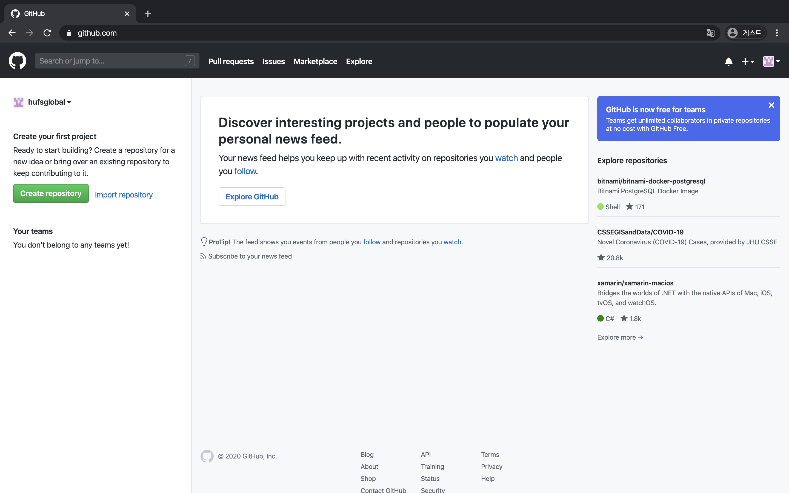

git-vscode-gitkraken
=

### Start !

시작은 VSCODE 와 github.com 이 켜진 상태로 시작하겠습니다. 
아래와 같이 두 창을 띄워둔 상태로 다음으로 넘어가주세요



### git 이란?
[git_위키피디아](https://ko.wikipedia.org/wiki/%EA%B9%83_(%EC%86%8C%ED%94%84%ED%8A%B8%EC%9B%A8%EC%96%B4))  
git의 가장 중요한 키워드는 버전 관리 시스템이라고 할 수 있습니다.  
만약 우리가 어떠한 문서작업을 할때 이전에 작성하였던 문서로 돌아기기 위해서는 아래의 사진과 같이 '다른이름으로 저장하기'기능을 사용하여서 여러가지의 파일을 만들게 되고 용량도 많이 차지하고 혼동을 줄수있는 결과를 가져올 수 있습니다.  

  

git 은 이러한 것을 파일 한개에서 히스토리(과거 기록/역사)를 남겨두어서 이전에 작성/저장하였던 버전으로 돌아갈수있고, 분기점을 만들어서 여러가지로 방법으로 문서를 편집하여서 비교하고 최종 선택을 통해서 한가지의 버전만 남기고 다른것들을 삭제하는것도 가능합니다.  

그렇다면 지금부터 git을 직접 사용하면서 알아보겠습니다.  
먼저 본인의 컴퓨터에 git을 설치해주어야 합니다. 우선 vscode의 상단부의 terminal 메뉴에서 new terminal을 선택하여서 terminal을 열어주세요.  


그렇게 되면 하단부에 이러한 창이 나오게 됩니다.  
본인의 컴퓨터 이름, 종류, 사용자 명 등이 나오고 뒤에 $ 표시가 있고 그 뒤에 입력할수있게 됩니다.  
  
그리고 그곳에 git이라고 입력하고 Enter후 사진처럼 나오면 git이 설치 된 환경이고 그렇지 않다면 설치과정을 거쳐야 합니다.  


``` bash
### 명령어를 복사할때 가장 왼쪽의 $를 빼고 복사해서 입력해주세요.
## mac용 패키지 관리자인 homebrew 를 설치합니다. (잠시동안 멈추는것은 다운로드되고있는것입니다.)
$ /bin/bash -c "$(curl -fsSL https://raw.githubusercontent.com/Homebrew/install/master/install.sh)"

## brew update 명령어로 brew 를 업데이트 합니다. (잠시동안 멈추는것은 업데이트진행중입니다.)
$ brew update 

## brew 를 이용해서 git을 설치합니다. 
$ brew install git

## install 이 끝난후 해당명령어를 입력후 바로 아래줄과 같이 버전정보가 나온다면 설치성공
$ git --version
git version 2.21.0 (Apple Git-122.2)
```
[window 깃 설정](../window.md)  
[다음으로](git-config.md)  
[README.md 로 이동](../README.md)